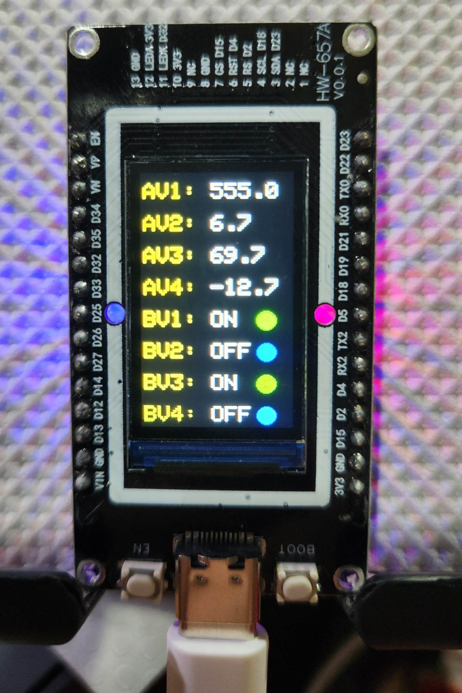
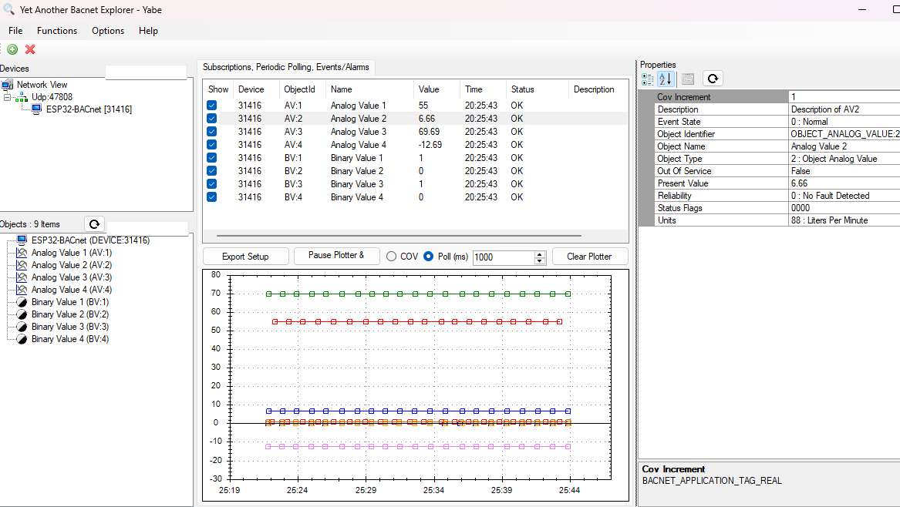

# BACnet-ESP32-Display

ESP32-based BACnet/IP device with ST7789 TFT display for monitoring 4 Analog Values (AV1-AV4) and 4 Binary Values (BV1-BV4). 

The user can easily add extra BACnet Objects and link them to the ESP32 GPIO, to integrate Analog and Digital inputs and outputs.

## Features

- **BACnet/IP Protocol**: Full BACnet/IP stack implementation
- **Live Display**: Real-time monitoring of BACnet objects on 170x320 TFT display
- **Analog Values**: 4 configurable analog values with present value tracking
- **Binary Values**: 4 configurable binary values with ON/OFF status indicators
- **WiFi Connectivity**: ESP32 with built-in WiFi for BACnet/IP communication
- **Arduino Framework**: Leverages Arduino ecosystem for easy hardware control
- **Change of Value (COV)**: Implements BACnet COV notifications for efficient real-time updates
- **Persistent Storage**: Attribute values modifiable from BACnet supervisor are automatically saved to ESP32 non-volatile memory (NVS) for retention across power cycles

## Photos




## Hardware Requirements

- **Microcontroller**: ESP32-WROOM-32
- **Display**: ST7789 SPI TFT (170x320 pixels)
- **Display Connections**:
  - MOSI: GPIO 23
  - SCLK: GPIO 18
  - CS: GPIO 15
  - DC: GPIO 2
  - RST: GPIO 4
  - BL (Backlight): GPIO 32

## Build Requirements

- ESP-IDF v5.5.1
- Python 3.11+
- xtensa-esp-elf toolchain

## Building

```bash
cd c:\esp\BACnet-ESP32-Display
idf.py build
```

## Flashing

```bash
idf.py flash -p COM3
```

Or use the provided build/flash tasks in VS Code.

## Monitoring Serial Output

```bash
idf.py monitor -p COM3
```

## Configuration

### Display Offset Calibration

The ST7789 display has a framebuffer offset that's compensated in [components/TFT_eSPI/User_Setup.h](components/TFT_eSPI/User_Setup.h):

```c
#define TFT_COLSTART 17   // Horizontal offset
#define TFT_ROWSTART 40   // Vertical offset
```

These values are specific to cheap Chinese clones and may need adjustment for your hardware.

### FreeRTOS Configuration

Arduino framework requires FreeRTOS tick rate of 1000Hz. This is set in [sdkconfig](sdkconfig):

```
CONFIG_FREERTOS_HZ=1000
```

### BACnet Object Configuration

- **Analog Values**: Configure names, descriptions, units, and initial values in [main/analog_value.c](main/analog_value.c) - **ANALOG VALUE CONFIGURATION** section

- **Binary Values**: Configure names, descriptions, active/inactive text, and initial states in [main/binary_value.c](main/binary_value.c) - **BINARY VALUE CONFIGURATION** section

## Architecture

### Components

- **[components/bacnet-stack](components/bacnet-stack)** - BACnet/IP stack (modified from bacnet-stack/bacnet-stack)
- **[components/TFT_eSPI](components/TFT_eSPI)** - TFT graphics library
- **[main](main/)** - Application code
  - `main.c` - BACnet initialization and main loop
  - `display.cpp` - TFT display driver
  - `wifi_helper.c` - WiFi configuration helpers

### Display Layout

| Item | Type | Display |
|------|------|---------|
| AV1 | Analog Value | Numeric (1 decimal) |
| AV2 | Analog Value | Numeric (1 decimal) |
| AV3 | Analog Value | Numeric (1 decimal) |
| AV4 | Analog Value | Numeric (1 decimal) |
| BV1 | Binary Value | ON/OFF + Status Dot (Blue=OFF, Green=ON) |
| BV2 | Binary Value | ON/OFF + Status Dot (Blue=OFF, Green=ON) |
| BV3 | Binary Value | ON/OFF + Status Dot (Blue=OFF, Green=ON) |
| BV4 | Binary Value | ON/OFF + Status Dot (Blue=OFF, Green=ON) |

## BACnet Integration

The device broadcasts its Device ID and manages BACnet objects that can be read/written by any BACnet/IP client (e.g., YABE, Tridium Niagara).

### BACnet Objects Exposed

- **Device**: 130 (configurable in main.c)
- **Analog Values**: Instance 1, 2, 3, 4
- **Binary Values**: Instance 1, 2, 3, 4

### Using with YABE

1. Start YABE (BACnet client)
2. Scan for devices
3. Locate "BACnet-ESP32-Display" device
4. Read/write Analog_Value or Binary_Value objects

## Modifications to bacnet-stack

This project uses the official [bacnet-stack](https://github.com/bacnet-stack/bacnet-stack) with the following modifications:

- **[components/bacnet-stack/](components/bacnet-stack/)** - Configured as ESP-IDF component
- Simplified for embedded systems (reduced features, optimized for ESP32)
- WiFi-based BACnet/IP instead of Ethernet

For a list of specific changes, see [BACNET_STACK_CHANGES.md](BACNET_STACK_CHANGES.md) (if available).

## Development Notes

### Display Boundary Constants

The display code uses boundary constants for easy layout modification:

```c
#define DISP_X0    17      // Left edge
#define DISP_Y0    40      // Top edge
#define DISP_X1    151     // Right edge
#define DISP_Y1    278     // Bottom edge
#define DISP_WIDTH 135
#define DISP_HEIGHT 239
```

Position all elements relative to these constants to avoid hardcoding coordinates.

## Troubleshooting

### Display offset issues
If text appears misaligned, adjust `TFT_COLSTART` and `TFT_ROWSTART` in User_Setup.h and recompile.

### WiFi connection fails
Check SSID/password in wifi_helper.c and ensure your router is compatible with ESP32's WiFi drivers.

### Linker errors with Arduino
Ensure `CONFIG_FREERTOS_HZ=1000` is set in sdkconfig and rebuild with `idf.py fullclean && idf.py build`.


## References

- [BACnet Stack GitHub](https://github.com/bacnet-stack/bacnet-stack)
- [ESP-IDF Documentation](https://docs.espressif.com/projects/esp-idf/en/stable/)
- [Arduino-ESP32 GitHub](https://github.com/espressif/arduino-esp32)
- [TFT_eSPI GitHub](https://github.com/Bodmer/TFT_eSPI)


